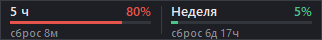

# Claude Usage Widget

**Автор идеи и разработки — [KOTS-666](https://github.com/KOTS-666)** (написано при помощи Claude).

Маленький виджет для панели задач Windows 10/11: показывает, сколько израсходовано
лимитов Claude — 5-часового и недельного — и когда они сбросятся.



- Встроен прямо в панель задач: двигается только влево-вправо, всегда поверх.
- Полоска зелёная до 50 %, жёлтая до 80 %, дальше красная.
- **Токены не тратит**: запрашивает только статистику лимитов, к модели не обращается.
- Обновляется раз в 3 минуты. Двойной клик — обновить сейчас.
- Прячется, когда открыто полноэкранное приложение (видео, игра).
- Правый клик — меню: статус, «Обновить», «Поверх всех окон», «Запускать с Windows»,
  «Автор: KOTS-666 — GitHub», «Закрыть».

## Что нужно

Установленный и залогиненный **[Claude Code](https://claude.com/claude-code)** с подпиской
Claude (Pro/Max). Виджет берёт ключ входа из файла, который ведёт Claude Code
(`%USERPROFILE%\.claude\.credentials.json`), и никуда его не отправляет, кроме
`api.anthropic.com`.

## Установка

### Вариант 1 — готовый .exe (Python не нужен)

1. Скачай `ClaudeUsageWidget.exe` со страницы [Releases](../../releases/latest).
2. Положи его в любую постоянную папку (например, `C:\Programs\ClaudeUsageWidget\`) и запусти.
3. Чтобы стартовал вместе с Windows: правый клик по виджету → «Запускать с Windows».

Windows SmartScreen может предупредить, что файл от неизвестного издателя (exe не подписан
сертификатом). Нажми «Подробнее» → «Выполнить в любом случае». Если не доверяешь —
используй вариант 2 или собери exe сам (`build.bat`).

### Вариант 2 — из исходников

Нужен Python 3.10+ (только стандартная библиотека):

```
pythonw widget.pyw
```

Собрать свой exe: `build.bat` → файл появится в `dist\`.

## Частые вопросы

- **«токен истёк — открой Claude Code»** — виджет специально не продлевает ключ сам,
  чтобы не сломать вход в Claude Code. Просто открой Claude Code, виджет подхватит новый
  ключ в течение 3 минут.
- **Оранжевая точка в углу** — данные устарели, причина видна в меню по правому клику.
- **«лимит запросов (429)»** — сервер просит реже спрашивать. Виджет сам делает паузу
  (5 → 10 → 20 → 30 мин) и продолжит.
- **Где настройки** — `state.json` рядом с `widget.pyw`, у exe —
  `%LOCALAPPDATA%\ClaudeUsageWidget\state.json`.

Это неофициальный проект, не связан с Anthropic. Эндпоинт статистики не документирован и
может измениться.

## English

Tiny Windows taskbar widget that shows your Claude 5-hour and weekly usage limits and
reset times. Idea and development by [KOTS-666](https://github.com/KOTS-666), built with Claude.
Spends no tokens (reads the usage endpoint only). Requires a logged-in
Claude Code. Download `ClaudeUsageWidget.exe` from Releases, or run `pythonw widget.pyw`.
Unofficial, not affiliated with Anthropic.

## Автор

[KOTS-666](https://github.com/KOTS-666) — идея, постановка задачи и разработка. Код написан
вместе с Claude. Понравилось — поставь ⭐ репозиторию.

## Лицензия

MIT © KOTS-666
